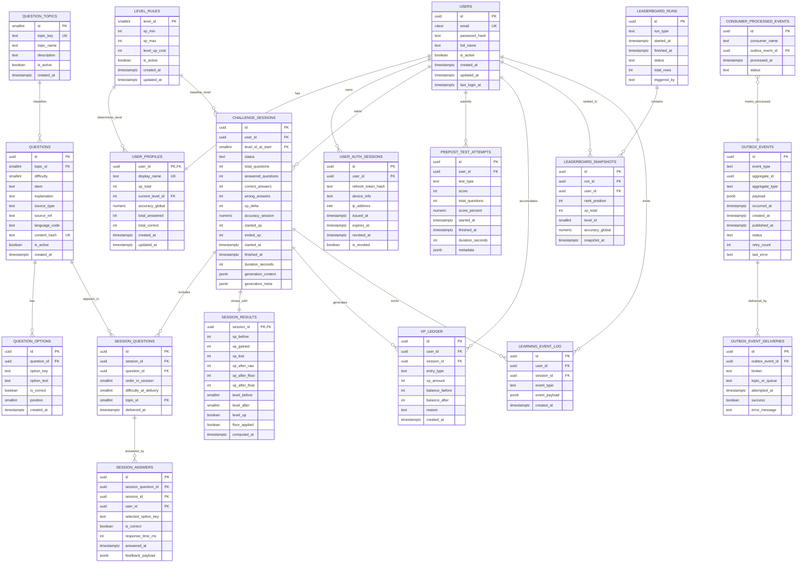

# DM de Base de Datos (MVP) — Sistema Gamificado IA para POO

## 1) Objetivo

Definir un diseño de base de datos **detallado y exhaustivo** para el MVP del sistema gamificado basado en IA, asegurando:

- consistencia transaccional,
- escalabilidad inicial,
- soporte para reglas de gamificación (XP, niveles, piso antifrustración),
- trazabilidad analítica (pre/post-test, rendimiento, retención),
- compatibilidad con arquitectura modulith + CQRS selectivo.

---

## 2) Alcance del modelo MVP

Este diseño cubre los módulos:

1. **Identity & Access**
2. **Learning Session**
3. **Gamification**
4. **Leaderboard (read model)**
5. **Analytics/Research (read model inicial)**
6. **Eventing técnico (Outbox + Idempotencia de consumidores)**

---

## 3) Diagrama entidad-relación (Mermaid)

> Nota: este ERD está orientado a implementación en PostgreSQL.



---

## 4) Diccionario de datos detallado

## 4.1 Módulo Identity & Access

### Tabla: `users`
**Propósito:** credenciales y datos base de cuenta.

| Campo | Tipo | Null | Restricciones |
|---|---|---:|---|
| id | UUID | No | PK |
| email | CITEXT | No | UNIQUE |
| password_hash | TEXT | No | hash Argon2/Bcrypt |
| full_name | TEXT | No |  |
| is_active | BOOLEAN | No | default true |
| created_at | TIMESTAMPTZ | No | default now() |
| updated_at | TIMESTAMPTZ | No | default now() |
| last_login_at | TIMESTAMPTZ | Sí |  |

---

### Tabla: `user_profiles`
**Propósito:** estado gamificado agregado por usuario.

| Campo | Tipo | Null | Restricciones |
|---|---|---:|---|
| user_id | UUID | No | PK, FK -> users(id) |
| display_name | TEXT | No | UNIQUE |
| xp_total | INT | No | CHECK (xp_total >= 0) |
| current_level_id | SMALLINT | No | FK -> level_rules(level_id) |
| accuracy_global | NUMERIC(5,2) | No | CHECK (accuracy_global between 0 and 100) |
| total_answered | INT | No | CHECK (total_answered >= 0) |
| total_correct | INT | No | CHECK (total_correct >= 0 and total_correct <= total_answered) |
| created_at | TIMESTAMPTZ | No | default now() |
| updated_at | TIMESTAMPTZ | No | default now() |

---

### Tabla: `user_auth_sessions`
**Propósito:** control de refresh tokens por dispositivo/sesión.

| Campo | Tipo |
|---|---|
| id (PK) | UUID |
| user_id (FK) | UUID -> users(id) |
| refresh_token_hash | TEXT |
| device_info | TEXT |
| ip_address | INET |
| issued_at | TIMESTAMPTZ |
| expires_at | TIMESTAMPTZ |
| revoked_at | TIMESTAMPTZ NULL |
| is_revoked | BOOLEAN default false |

Índice recomendado: `(user_id, is_revoked, expires_at)`.

---

## 4.2 Módulo Gamification

### Tabla: `level_rules`
**Propósito:** parametrizar niveles (evitar hardcode).

| Campo | Tipo | Restricción |
|---|---|---|
| level_id | SMALLINT | PK |
| xp_min | INT | NOT NULL |
| xp_max | INT | NOT NULL |
| level_up_cost | INT | NOT NULL |
| is_active | BOOLEAN | default true |
| created_at | TIMESTAMPTZ | default now() |
| updated_at | TIMESTAMPTZ | default now() |

**Checks clave:**
- `xp_min >= 0`
- `xp_max >= xp_min`
- `level_up_cost > 0`

> Para MVP cargar niveles 1..7.

---

### Tabla: `xp_ledger`
**Propósito:** libro contable inmutable de movimientos XP.

| Campo | Tipo | Restricción |
|---|---|---|
| id | UUID | PK |
| user_id | UUID | FK -> users |
| session_id | UUID NULL | FK -> challenge_sessions |
| entry_type | TEXT | CHECK IN ('GAIN','LOSS','ADJUSTMENT','FLOOR_PROTECTION') |
| xp_amount | INT | NOT NULL |
| balance_before | INT | CHECK >= 0 |
| balance_after | INT | CHECK >= 0 |
| reason | TEXT | NOT NULL |
| created_at | TIMESTAMPTZ | default now() |

Índices:
- `(user_id, created_at desc)`
- `(session_id)`

---

## 4.3 Módulo Learning Session

### Tabla: `question_topics`
Catálogo canónico de temas POO.

| Campo | Tipo | Restricción |
|---|---|---|
| id | SMALLINT | PK |
| topic_key | TEXT | UNIQUE (ej: `polymorphism_overriding`) |
| topic_name | TEXT | NOT NULL |
| description | TEXT | NULL |
| is_active | BOOLEAN | default true |
| created_at | TIMESTAMPTZ | default now() |

---

### Tabla: `questions`
Banco de preguntas normalizado.

| Campo | Tipo | Restricción |
|---|---|---|
| id | UUID | PK |
| topic_id | SMALLINT | FK -> question_topics(id) |
| difficulty | SMALLINT | CHECK between 1 and 5 |
| stem | TEXT | NOT NULL |
| explanation | TEXT | NOT NULL |
| source_type | TEXT | CHECK IN ('AI','CURATED','FALLBACK') |
| source_ref | TEXT | NULL |
| language_code | TEXT | default 'es-PE' |
| content_hash | TEXT | UNIQUE |
| is_active | BOOLEAN | default true |
| created_at | TIMESTAMPTZ | default now() |

`content_hash` ayuda a evitar duplicados exactos.

---

### Tabla: `question_options`
Opciones de cada pregunta.

| Campo | Tipo | Restricción |
|---|---|---|
| id | UUID | PK |
| question_id | UUID | FK -> questions(id) ON DELETE CASCADE |
| option_key | TEXT | ej: A/B/C/D |
| option_text | TEXT | NOT NULL |
| is_correct | BOOLEAN | NOT NULL |
| position | SMALLINT | CHECK between 1 and 6 |
| created_at | TIMESTAMPTZ | default now() |

Restricciones recomendadas:
- UNIQUE `(question_id, option_key)`
- UNIQUE `(question_id, position)`

Regla lógica (app/db trigger): **solo una opción correcta por pregunta**.

---

### Tabla: `challenge_sessions`
Cabecera de sesión de reto (5 preguntas).

| Campo | Tipo | Restricción |
|---|---|---|
| id | UUID | PK |
| user_id | UUID | FK -> users |
| level_id_at_start | SMALLINT | FK -> level_rules(level_id) |
| status | TEXT | CHECK IN ('IN_PROGRESS','FINISHED','ABANDONED') |
| total_questions | INT | default 5 CHECK (=5 para MVP) |
| answered_questions | INT | CHECK >=0 |
| correct_answers | INT | CHECK >=0 |
| wrong_answers | INT | CHECK >=0 |
| xp_delta | INT | default 0 |
| accuracy_session | NUMERIC(5,2) | CHECK between 0 and 100 |
| started_xp | INT | CHECK >=0 |
| ended_xp | INT | CHECK >=0 |
| started_at | TIMESTAMPTZ | default now() |
| finished_at | TIMESTAMPTZ | NULL |
| duration_seconds | INT | NULL CHECK >=0 |
| generation_context | JSONB | contexto enviado a IA |
| generation_meta | JSONB | modelo, latencia, retries, etc |

Índices:
- `(user_id, started_at desc)`
- `(status, started_at desc)`

---

### Tabla: `session_questions`
Preguntas entregadas en una sesión (snapshot de entrega).

| Campo | Tipo | Restricción |
|---|---|---|
| id | UUID | PK |
| session_id | UUID | FK -> challenge_sessions ON DELETE CASCADE |
| question_id | UUID | FK -> questions |
| order_in_session | SMALLINT | CHECK between 1 and 5 |
| difficulty_at_delivery | SMALLINT | CHECK between 1 and 5 |
| topic_id | SMALLINT | FK -> question_topics |
| delivered_at | TIMESTAMPTZ | default now() |

Unicidad:
- UNIQUE `(session_id, order_in_session)`
- UNIQUE `(session_id, question_id)` (evita repetir pregunta en la misma sesión)

---

### Tabla: `session_answers`
Respuesta del usuario por pregunta en sesión.

| Campo | Tipo | Restricción |
|---|---|---|
| id | UUID | PK |
| session_question_id | UUID | FK -> session_questions(id) ON DELETE CASCADE |
| session_id | UUID | FK -> challenge_sessions(id) |
| user_id | UUID | FK -> users(id) |
| selected_option_key | TEXT | NOT NULL |
| is_correct | BOOLEAN | NOT NULL |
| response_time_ms | INT | CHECK >= 0 |
| answered_at | TIMESTAMPTZ | default now() |
| feedback_payload | JSONB | explicación/feedback mostrado |

Unicidad:
- UNIQUE `(session_question_id)` (una sola respuesta por pregunta de sesión)

Índices:
- `(user_id, answered_at desc)`
- `(session_id)`

---

### Tabla: `session_results`
Resultado final y cálculo formal de XP/nivel al cerrar sesión.

| Campo | Tipo | Restricción |
|---|---|---|
| session_id | UUID | PK, FK -> challenge_sessions(id) |
| xp_before | INT | CHECK >=0 |
| xp_gained | INT | CHECK >=0 |
| xp_lost | INT | CHECK >=0 |
| xp_after_raw | INT | CHECK >=0 |
| xp_after_floor | INT | CHECK >=0 |
| xp_after_final | INT | CHECK >=0 |
| level_before | SMALLINT | FK -> level_rules |
| level_after | SMALLINT | FK -> level_rules |
| level_up | BOOLEAN | NOT NULL |
| floor_applied | BOOLEAN | NOT NULL |
| computed_at | TIMESTAMPTZ | default now() |

---

## 4.4 Módulo Leaderboard (CQRS read model)

### Tabla: `leaderboard_runs`
Auditoría de cada reconstrucción/actualización de ranking.

| Campo | Tipo |
|---|---|
| id (PK) | UUID |
| run_type | TEXT (`FULL`,`INCREMENTAL`) |
| started_at | TIMESTAMPTZ |
| finished_at | TIMESTAMPTZ |
| status | TEXT (`RUNNING`,`SUCCESS`,`FAILED`) |
| total_rows | INT |
| triggered_by | TEXT (`SCHEDULER`,`EVENT_WORKER`,`MANUAL`) |

---

### Tabla: `leaderboard_snapshots`
Snapshot materializado del ranking.

| Campo | Tipo | Restricción |
|---|---|---|
| id | UUID | PK |
| run_id | UUID | FK -> leaderboard_runs |
| user_id | UUID | FK -> users |
| rank_position | INT | CHECK > 0 |
| xp_total | INT | CHECK >= 0 |
| level_id | SMALLINT | FK -> level_rules |
| accuracy_global | NUMERIC(5,2) | CHECK 0..100 |
| snapshot_at | TIMESTAMPTZ | default now() |

Unicidad recomendada:
- UNIQUE `(run_id, user_id)`
- UNIQUE `(run_id, rank_position)`

Índice de consulta:
- `(snapshot_at desc, rank_position asc)`

---

## 4.5 Módulo Analytics/Research

### Tabla: `learning_event_log`
Bitácora analítica de eventos académicos y de interacción.

| Campo | Tipo |
|---|---|
| id (PK) | UUID |
| user_id (FK) | UUID |
| session_id (FK, NULL) | UUID |
| event_type | TEXT |
| event_payload | JSONB |
| created_at | TIMESTAMPTZ |

Ejemplos `event_type`:
- `SESSION_STARTED`
- `QUESTION_ANSWERED`
- `SESSION_FINISHED`
- `LEVEL_UP`
- `PRETEST_SUBMITTED`
- `POSTTEST_SUBMITTED`

Índices:
- `(event_type, created_at desc)`
- `(user_id, created_at desc)`

---

### Tabla: `prepost_test_attempts`
Resultados de instrumentos pre-test/post-test.

| Campo | Tipo | Restricción |
|---|---|---|
| id | UUID | PK |
| user_id | UUID | FK -> users |
| test_type | TEXT | CHECK IN ('PRE_TEST','POST_TEST') |
| score | INT | CHECK >=0 |
| total_questions | INT | CHECK >0 |
| score_percent | NUMERIC(5,2) | CHECK 0..100 |
| started_at | TIMESTAMPTZ |  |
| finished_at | TIMESTAMPTZ |  |
| duration_seconds | INT | CHECK >=0 |
| metadata | JSONB | cohorte, aula, observaciones |

Índice:
- `(user_id, test_type, finished_at desc)`

---

## 4.6 Eventing técnico

### Tabla: `outbox_events`
Eventos pendientes/publicados para mensajería confiable.

| Campo | Tipo |
|---|---|
| id (PK) | UUID |
| event_type | TEXT |
| aggregate_id | UUID |
| aggregate_type | TEXT |
| payload | JSONB |
| occurred_at | TIMESTAMPTZ |
| created_at | TIMESTAMPTZ |
| published_at | TIMESTAMPTZ NULL |
| status | TEXT (`PENDING`,`PUBLISHED`,`FAILED`) |
| retry_count | INT default 0 |
| last_error | TEXT NULL |

Índices:
- `(status, created_at asc)`
- `(aggregate_type, aggregate_id)`

---

### Tabla: `outbox_event_deliveries`
Histórico de intentos de entrega al broker.

| Campo | Tipo |
|---|---|
| id (PK) | UUID |
| outbox_event_id (FK) | UUID -> outbox_events(id) |
| broker | TEXT |
| topic_or_queue | TEXT |
| attempted_at | TIMESTAMPTZ |
| success | BOOLEAN |
| error_message | TEXT |

---

### Tabla: `consumer_processed_events`
Idempotencia por consumidor.

| Campo | Tipo | Restricción |
|---|---|---|
| id | UUID | PK |
| consumer_name | TEXT | NOT NULL |
| outbox_event_id | UUID | FK -> outbox_events |
| processed_at | TIMESTAMPTZ | default now() |
| status | TEXT | (`PROCESSED`,`SKIPPED`,`FAILED`) |

Unicidad crítica:
- UNIQUE `(consumer_name, outbox_event_id)`

---

## 5) Reglas de negocio implementadas en BD (mínimo)

1. `xp_total >= 0` siempre.
2. `accuracy_global` y `accuracy_session` entre 0 y 100.
3. Sesión MVP con `total_questions = 5`.
4. Una respuesta por pregunta de sesión.
5. No duplicar pregunta dentro de la misma sesión.
6. Integridad de niveles por FK a `level_rules`.
7. Ledger XP inmutable (no updates destructivos; solo inserciones).
8. Idempotencia de consumidores de eventos.

---

## 6) Índices exhaustivos recomendados

```sql
-- USERS / PROFILE
CREATE UNIQUE INDEX ux_users_email ON users(email);
CREATE UNIQUE INDEX ux_user_profiles_display_name ON user_profiles(display_name);

-- SESSIONES
CREATE INDEX ix_challenge_sessions_user_started ON challenge_sessions(user_id, started_at DESC);
CREATE INDEX ix_challenge_sessions_status_started ON challenge_sessions(status, started_at DESC);

-- RESPUESTAS
CREATE INDEX ix_session_answers_user_answered ON session_answers(user_id, answered_at DESC);
CREATE INDEX ix_session_answers_session ON session_answers(session_id);

-- XP
CREATE INDEX ix_xp_ledger_user_created ON xp_ledger(user_id, created_at DESC);
CREATE INDEX ix_xp_ledger_session ON xp_ledger(session_id);

-- LEADERBOARD
CREATE INDEX ix_leaderboard_snapshots_time_rank ON leaderboard_snapshots(snapshot_at DESC, rank_position ASC);
CREATE INDEX ix_leaderboard_snapshots_user ON leaderboard_snapshots(user_id, snapshot_at DESC);

-- ANALYTICS
CREATE INDEX ix_learning_event_type_time ON learning_event_log(event_type, created_at DESC);
CREATE INDEX ix_learning_event_user_time ON learning_event_log(user_id, created_at DESC);
CREATE INDEX ix_prepost_user_type_time ON prepost_test_attempts(user_id, test_type, finished_at DESC);

-- OUTBOX
CREATE INDEX ix_outbox_status_created ON outbox_events(status, created_at ASC);
CREATE INDEX ix_outbox_aggregate ON outbox_events(aggregate_type, aggregate_id);

-- IDEMPOTENCIA
CREATE UNIQUE INDEX ux_consumer_processed_unique
  ON consumer_processed_events(consumer_name, outbox_event_id);
```

---

## 7) Extensiones PostgreSQL recomendadas

```sql
CREATE EXTENSION IF NOT EXISTS "pgcrypto";   -- gen_random_uuid()
CREATE EXTENSION IF NOT EXISTS "citext";     -- email case-insensitive
```

---

## 8) Semillas iniciales (seed data) obligatorias

1. `level_rules` niveles 1..7 con rangos completos.
2. `question_topics` catálogo base POO:
   - clases_objetos
   - encapsulamiento
   - herencia
   - polimorfismo
   - abstraccion
   - interfaces
   - sobrecarga_sobrescritura
   - relaciones_asociacion_agregacion_composicion
3. Usuario admin/investigador (solo entorno no productivo).
4. Banco mínimo fallback de preguntas curadas.

---

## 9) SQL DDL inicial (base ejecutable)

```sql
-- =========================================================
-- CORE: users / profiles / levels
-- =========================================================
CREATE TABLE users (
  id UUID PRIMARY KEY DEFAULT gen_random_uuid(),
  email CITEXT NOT NULL UNIQUE,
  password_hash TEXT NOT NULL,
  full_name TEXT NOT NULL,
  is_active BOOLEAN NOT NULL DEFAULT TRUE,
  created_at TIMESTAMPTZ NOT NULL DEFAULT now(),
  updated_at TIMESTAMPTZ NOT NULL DEFAULT now(),
  last_login_at TIMESTAMPTZ NULL
);

CREATE TABLE level_rules (
  level_id SMALLINT PRIMARY KEY,
  xp_min INT NOT NULL CHECK (xp_min >= 0),
  xp_max INT NOT NULL CHECK (xp_max >= xp_min),
  level_up_cost INT NOT NULL CHECK (level_up_cost > 0),
  is_active BOOLEAN NOT NULL DEFAULT TRUE,
  created_at TIMESTAMPTZ NOT NULL DEFAULT now(),
  updated_at TIMESTAMPTZ NOT NULL DEFAULT now()
);

CREATE TABLE user_profiles (
  user_id UUID PRIMARY KEY REFERENCES users(id) ON DELETE CASCADE,
  display_name TEXT NOT NULL UNIQUE,
  xp_total INT NOT NULL DEFAULT 0 CHECK (xp_total >= 0),
  current_level_id SMALLINT NOT NULL REFERENCES level_rules(level_id),
  accuracy_global NUMERIC(5,2) NOT NULL DEFAULT 0 CHECK (accuracy_global >= 0 AND accuracy_global <= 100),
  total_answered INT NOT NULL DEFAULT 0 CHECK (total_answered >= 0),
  total_correct INT NOT NULL DEFAULT 0 CHECK (total_correct >= 0),
  created_at TIMESTAMPTZ NOT NULL DEFAULT now(),
  updated_at TIMESTAMPTZ NOT NULL DEFAULT now(),
  CHECK (total_correct <= total_answered)
);

-- =========================================================
-- AUTH SESSIONS
-- =========================================================
CREATE TABLE user_auth_sessions (
  id UUID PRIMARY KEY DEFAULT gen_random_uuid(),
  user_id UUID NOT NULL REFERENCES users(id) ON DELETE CASCADE,
  refresh_token_hash TEXT NOT NULL,
  device_info TEXT NULL,
  ip_address INET NULL,
  issued_at TIMESTAMPTZ NOT NULL DEFAULT now(),
  expires_at TIMESTAMPTZ NOT NULL,
  revoked_at TIMESTAMPTZ NULL,
  is_revoked BOOLEAN NOT NULL DEFAULT FALSE
);

-- =========================================================
-- QUESTIONS / TOPICS
-- =========================================================
CREATE TABLE question_topics (
  id SMALLINT PRIMARY KEY,
  topic_key TEXT NOT NULL UNIQUE,
  topic_name TEXT NOT NULL,
  description TEXT NULL,
  is_active BOOLEAN NOT NULL DEFAULT TRUE,
  created_at TIMESTAMPTZ NOT NULL DEFAULT now()
);

CREATE TABLE questions (
  id UUID PRIMARY KEY DEFAULT gen_random_uuid(),
  topic_id SMALLINT NOT NULL REFERENCES question_topics(id),
  difficulty SMALLINT NOT NULL CHECK (difficulty BETWEEN 1 AND 5),
  stem TEXT NOT NULL,
  explanation TEXT NOT NULL,
  source_type TEXT NOT NULL CHECK (source_type IN ('AI','CURATED','FALLBACK')),
  source_ref TEXT NULL,
  language_code TEXT NOT NULL DEFAULT 'es-PE',
  content_hash TEXT NOT NULL UNIQUE,
  is_active BOOLEAN NOT NULL DEFAULT TRUE,
  created_at TIMESTAMPTZ NOT NULL DEFAULT now()
);

CREATE TABLE question_options (
  id UUID PRIMARY KEY DEFAULT gen_random_uuid(),
  question_id UUID NOT NULL REFERENCES questions(id) ON DELETE CASCADE,
  option_key TEXT NOT NULL,
  option_text TEXT NOT NULL,
  is_correct BOOLEAN NOT NULL,
  position SMALLINT NOT NULL CHECK (position BETWEEN 1 AND 6),
  created_at TIMESTAMPTZ NOT NULL DEFAULT now(),
  UNIQUE (question_id, option_key),
  UNIQUE (question_id, position)
);

-- =========================================================
-- CHALLENGE SESSIONS
-- =========================================================
CREATE TABLE challenge_sessions (
  id UUID PRIMARY KEY DEFAULT gen_random_uuid(),
  user_id UUID NOT NULL REFERENCES users(id) ON DELETE CASCADE,
  level_id_at_start SMALLINT NOT NULL REFERENCES level_rules(level_id),
  status TEXT NOT NULL CHECK (status IN ('IN_PROGRESS','FINISHED','ABANDONED')),
  total_questions INT NOT NULL DEFAULT 5 CHECK (total_questions = 5),
  answered_questions INT NOT NULL DEFAULT 0 CHECK (answered_questions >= 0),
  correct_answers INT NOT NULL DEFAULT 0 CHECK (correct_answers >= 0),
  wrong_answers INT NOT NULL DEFAULT 0 CHECK (wrong_answers >= 0),
  xp_delta INT NOT NULL DEFAULT 0,
  accuracy_session NUMERIC(5,2) NULL CHECK (accuracy_session >= 0 AND accuracy_session <= 100),
  started_xp INT NOT NULL CHECK (started_xp >= 0),
  ended_xp INT NULL CHECK (ended_xp >= 0),
  started_at TIMESTAMPTZ NOT NULL DEFAULT now(),
  finished_at TIMESTAMPTZ NULL,
  duration_seconds INT NULL CHECK (duration_seconds >= 0),
  generation_context JSONB NULL,
  generation_meta JSONB NULL
);

CREATE TABLE session_questions (
  id UUID PRIMARY KEY DEFAULT gen_random_uuid(),
  session_id UUID NOT NULL REFERENCES challenge_sessions(id) ON DELETE CASCADE,
  question_id UUID NOT NULL REFERENCES questions(id),
  order_in_session SMALLINT NOT NULL CHECK (order_in_session BETWEEN 1 AND 5),
  difficulty_at_delivery SMALLINT NOT NULL CHECK (difficulty_at_delivery BETWEEN 1 AND 5),
  topic_id SMALLINT NOT NULL REFERENCES question_topics(id),
  delivered_at TIMESTAMPTZ NOT NULL DEFAULT now(),
  UNIQUE (session_id, order_in_session),
  UNIQUE (session_id, question_id)
);

CREATE TABLE session_answers (
  id UUID PRIMARY KEY DEFAULT gen_random_uuid(),
  session_question_id UUID NOT NULL UNIQUE REFERENCES session_questions(id) ON DELETE CASCADE,
  session_id UUID NOT NULL REFERENCES challenge_sessions(id) ON DELETE CASCADE,
  user_id UUID NOT NULL REFERENCES users(id) ON DELETE CASCADE,
  selected_option_key TEXT NOT NULL,
  is_correct BOOLEAN NOT NULL,
  response_time_ms INT NOT NULL CHECK (response_time_ms >= 0),
  answered_at TIMESTAMPTZ NOT NULL DEFAULT now(),
  feedback_payload JSONB NULL
);

CREATE TABLE session_results (
  session_id UUID PRIMARY KEY REFERENCES challenge_sessions(id) ON DELETE CASCADE,
  xp_before INT NOT NULL CHECK (xp_before >= 0),
  xp_gained INT NOT NULL CHECK (xp_gained >= 0),
  xp_lost INT NOT NULL CHECK (xp_lost >= 0),
  xp_after_raw INT NOT NULL CHECK (xp_after_raw >= 0),
  xp_after_floor INT NOT NULL CHECK (xp_after_floor >= 0),
  xp_after_final INT NOT NULL CHECK (xp_after_final >= 0),
  level_before SMALLINT NOT NULL REFERENCES level_rules(level_id),
  level_after SMALLINT NOT NULL REFERENCES level_rules(level_id),
  level_up BOOLEAN NOT NULL,
  floor_applied BOOLEAN NOT NULL,
  computed_at TIMESTAMPTZ NOT NULL DEFAULT now()
);

-- =========================================================
-- XP LEDGER
-- =========================================================
CREATE TABLE xp_ledger (
  id UUID PRIMARY KEY DEFAULT gen_random_uuid(),
  user_id UUID NOT NULL REFERENCES users(id) ON DELETE CASCADE,
  session_id UUID NULL REFERENCES challenge_sessions(id) ON DELETE SET NULL,
  entry_type TEXT NOT NULL CHECK (entry_type IN ('GAIN','LOSS','ADJUSTMENT','FLOOR_PROTECTION')),
  xp_amount INT NOT NULL,
  balance_before INT NOT NULL CHECK (balance_before >= 0),
  balance_after INT NOT NULL CHECK (balance_after >= 0),
  reason TEXT NOT NULL,
  created_at TIMESTAMPTZ NOT NULL DEFAULT now()
);

-- =========================================================
-- LEADERBOARD READ MODEL
-- =========================================================
CREATE TABLE leaderboard_runs (
  id UUID PRIMARY KEY DEFAULT gen_random_uuid(),
  run_type TEXT NOT NULL CHECK (run_type IN ('FULL','INCREMENTAL')),
  started_at TIMESTAMPTZ NOT NULL DEFAULT now(),
  finished_at TIMESTAMPTZ NULL,
  status TEXT NOT NULL CHECK (status IN ('RUNNING','SUCCESS','FAILED')),
  total_rows INT NULL,
  triggered_by TEXT NOT NULL CHECK (triggered_by IN ('SCHEDULER','EVENT_WORKER','MANUAL'))
);

CREATE TABLE leaderboard_snapshots (
  id UUID PRIMARY KEY DEFAULT gen_random_uuid(),
  run_id UUID NOT NULL REFERENCES leaderboard_runs(id) ON DELETE CASCADE,
  user_id UUID NOT NULL REFERENCES users(id) ON DELETE CASCADE,
  rank_position INT NOT NULL CHECK (rank_position > 0),
  xp_total INT NOT NULL CHECK (xp_total >= 0),
  level_id SMALLINT NOT NULL REFERENCES level_rules(level_id),
  accuracy_global NUMERIC(5,2) NOT NULL CHECK (accuracy_global >= 0 AND accuracy_global <= 100),
  snapshot_at TIMESTAMPTZ NOT NULL DEFAULT now(),
  UNIQUE (run_id, user_id),
  UNIQUE (run_id, rank_position)
);

-- =========================================================
-- ANALYTICS / RESEARCH
-- =========================================================
CREATE TABLE learning_event_log (
  id UUID PRIMARY KEY DEFAULT gen_random_uuid(),
  user_id UUID NOT NULL REFERENCES users(id) ON DELETE CASCADE,
  session_id UUID NULL REFERENCES challenge_sessions(id) ON DELETE SET NULL,
  event_type TEXT NOT NULL,
  event_payload JSONB NOT NULL DEFAULT '{}'::jsonb,
  created_at TIMESTAMPTZ NOT NULL DEFAULT now()
);

CREATE TABLE prepost_test_attempts (
  id UUID PRIMARY KEY DEFAULT gen_random_uuid(),
  user_id UUID NOT NULL REFERENCES users(id) ON DELETE CASCADE,
  test_type TEXT NOT NULL CHECK (test_type IN ('PRE_TEST','POST_TEST')),
  score INT NOT NULL CHECK (score >= 0),
  total_questions INT NOT NULL CHECK (total_questions > 0),
  score_percent NUMERIC(5,2) NOT NULL CHECK (score_percent >= 0 AND score_percent <= 100),
  started_at TIMESTAMPTZ NOT NULL,
  finished_at TIMESTAMPTZ NOT NULL,
  duration_seconds INT NOT NULL CHECK (duration_seconds >= 0),
  metadata JSONB NOT NULL DEFAULT '{}'::jsonb
);

-- =========================================================
-- OUTBOX / IDEMPOTENCY
-- =========================================================
CREATE TABLE outbox_events (
  id UUID PRIMARY KEY DEFAULT gen_random_uuid(),
  event_type TEXT NOT NULL,
  aggregate_id UUID NOT NULL,
  aggregate_type TEXT NOT NULL,
  payload JSONB NOT NULL,
  occurred_at TIMESTAMPTZ NOT NULL,
  created_at TIMESTAMPTZ NOT NULL DEFAULT now(),
  published_at TIMESTAMPTZ NULL,
  status TEXT NOT NULL CHECK (status IN ('PENDING','PUBLISHED','FAILED')) DEFAULT 'PENDING',
  retry_count INT NOT NULL DEFAULT 0,
  last_error TEXT NULL
);

CREATE TABLE outbox_event_deliveries (
  id UUID PRIMARY KEY DEFAULT gen_random_uuid(),
  outbox_event_id UUID NOT NULL REFERENCES outbox_events(id) ON DELETE CASCADE,
  broker TEXT NOT NULL,
  topic_or_queue TEXT NOT NULL,
  attempted_at TIMESTAMPTZ NOT NULL DEFAULT now(),
  success BOOLEAN NOT NULL,
  error_message TEXT NULL
);

CREATE TABLE consumer_processed_events (
  id UUID PRIMARY KEY DEFAULT gen_random_uuid(),
  consumer_name TEXT NOT NULL,
  outbox_event_id UUID NOT NULL REFERENCES outbox_events(id) ON DELETE CASCADE,
  processed_at TIMESTAMPTZ NOT NULL DEFAULT now(),
  status TEXT NOT NULL CHECK (status IN ('PROCESSED','SKIPPED','FAILED')),
  UNIQUE (consumer_name, outbox_event_id)
);
```

---

## 10) Triggers y funciones recomendadas (MVP+)

1. `set_updated_at()` para tablas con `updated_at`.
2. Trigger de integridad para `question_options`:
   - impedir más de una opción correcta por `question_id`.
3. Trigger de consistencia en `challenge_sessions` al cerrar:
   - `answered_questions = correct_answers + wrong_answers`.
4. Trigger opcional para auto-cálculo `score_percent` en `prepost_test_attempts`.

---

## 11) Consultas clave de negocio (ejemplos)

### Top 10 leaderboard actual (último run exitoso)
```sql
WITH last_run AS (
  SELECT id
  FROM leaderboard_runs
  WHERE status = 'SUCCESS'
  ORDER BY finished_at DESC
  LIMIT 1
)
SELECT ls.rank_position, u.full_name, ls.xp_total, ls.level_id, ls.accuracy_global
FROM leaderboard_snapshots ls
JOIN last_run lr ON lr.id = ls.run_id
JOIN users u ON u.id = ls.user_id
ORDER BY ls.rank_position
LIMIT 10;
```

### Precisión global por usuario
```sql
SELECT
  up.user_id,
  up.total_correct,
  up.total_answered,
  CASE WHEN up.total_answered = 0 THEN 0
       ELSE ROUND((up.total_correct::numeric / up.total_answered::numeric) * 100, 2)
  END AS accuracy_percent
FROM user_profiles up;
```

### Delta pre-test vs post-test
```sql
WITH pre AS (
  SELECT user_id, MAX(score_percent) AS pre_score
  FROM prepost_test_attempts
  WHERE test_type = 'PRE_TEST'
  GROUP BY user_id
),
post AS (
  SELECT user_id, MAX(score_percent) AS post_score
  FROM prepost_test_attempts
  WHERE test_type = 'POST_TEST'
  GROUP BY user_id
)
SELECT
  u.id AS user_id,
  u.full_name,
  pre.pre_score,
  post.post_score,
  (post.post_score - pre.pre_score) AS improvement
FROM users u
LEFT JOIN pre ON pre.user_id = u.id
LEFT JOIN post ON post.user_id = u.id;
```

---

## 12) Estrategia de migraciones

Orden recomendado de Alembic migrations:

1. extensiones (`citext`, `pgcrypto`)
2. `users`, `level_rules`, `user_profiles`, `user_auth_sessions`
3. `question_topics`, `questions`, `question_options`
4. `challenge_sessions`, `session_questions`, `session_answers`, `session_results`
5. `xp_ledger`
6. `leaderboard_runs`, `leaderboard_snapshots`
7. `learning_event_log`, `prepost_test_attempts`
8. `outbox_events`, `outbox_event_deliveries`, `consumer_processed_events`
9. índices
10. seeds iniciales

---

## 13) Checklist de validación final (MVP)

- [ ] Niveles 1..7 sembrados y validados.
- [ ] Restricciones de XP no negativo activas.
- [ ] Unicidad de respuestas por pregunta de sesión validada.
- [ ] Integridad de opciones correctas por pregunta verificada.
- [ ] Índices críticos creados.
- [ ] Outbox + idempotencia funcionando.
- [ ] Consultas leaderboard < 100ms (con caché) en entorno de prueba.
- [ ] Queries de analítica pre/post disponibles para investigación.

---

## 14) Conclusión

Este diseño de BD MVP permite construir el sistema con una base sólida, auditable y extensible, cubriendo tanto la operación del producto gamificado como la medición rigurosa del impacto académico.  
Está preparado para crecer sin rehacer el modelo central: separa correctamente transaccionalidad, lectura optimizada y mensajería confiable.